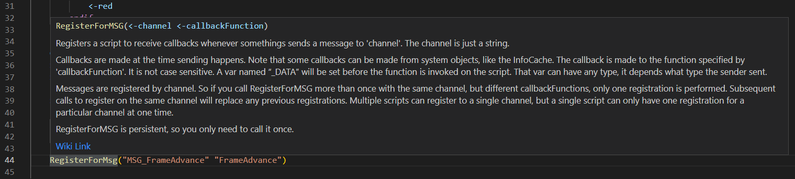
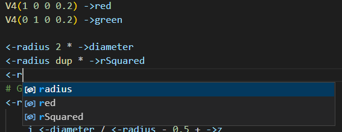
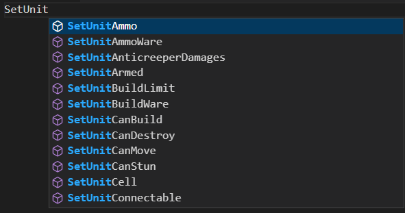

# 4rpl-lang

VSCode Language support for Creeper World 4's 4RPL language.

## Features

- Syntax Highlighting
- Auto-indentation when creating blocks
- Hover information for commands from the game's wiki.
- Autocomplete for built-in commands, local variables and functions.
- Basic error checking for invalid commands
- More features are planned

### Wiki on Hover

### Variable Autocomplete

### Command Autocomplete

## Release Notes

### 0.4.0
- Add basic diagnostic checking
- Separate features into different files for readability

### 0.3.0

- Add hover information for built-in commands from the wiki.
- Add autocomplete for built-in commands, local variables and functions.

### 0.2.0

- Language grammar is now written in YAML and converted to JSON.
- Autoindent upon entering a block.
- Variables will now be recognised when accessing vector values, i.e. `<-var.x`.
- Other miscellaneous fixes.

### 0.1.0

- Initial release