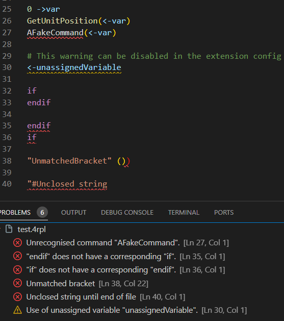

# xrpl-lang

VSCode Language support for Creeper World 4's 4RPL and Creeper World IXE's IRPL.

## Features

- Syntax Highlighting.
- Auto-indentation when creating blocks.
- Hover information for commands from the KnuckleCracker wiki.
- Hover information for local functions.
- Autocomplete for built-in commands, local variables and functions.
- Rudimentary Error diagnostics.
- Colour picker for Vector 4 values.
- A command to read the game's RPL.txt output file.
- Go to definition for local functions.

### Syntax Highlighting

### Hover for built-in and local Functions

### Variable Autocomplete

### Command Autocomplete

### Diagnostics

### Colour Picker

## Release Notes
See the [Change Log](/CHANGELOG.md).